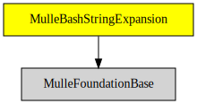

# MulleBashStringExpansion

#### 🤯 Bash like string expansion

Does bash-like string expansion like `${foo:-bar}`


| Release Version                                       | Release Notes  | AI Documentation
|-------------------------------------------------------|----------------|---------------
|  [](//github.com/MulleWeb/MulleBashStringExpansion/actions) | [RELEASENOTES](RELEASENOTES.md) | [DeepWiki for MulleBashStringExpansion](https://deepwiki.com/MulleWeb/MulleBashStringExpansion)


## Supported String Expansions

MulleBashStringExpansion does a subset of the bash string expansions.
See [Bash Manual - 3.5.3 Shell Parameter Expansion](https://www.gnu.org/software/bash/manual/html_node/Shell-Parameter-Expansion.html) for a list of operations that are defined
a string expansion and a description of what each operation does. If
you are not familiar with it, its best to try out the bash expansion first,
then this will become clearer:

| Supported Expansion            | Description
|--------------------------------|------------------------
| `${parameter:-expr}`           | Use expr, if parameter is empty. Expr can itself be a string expression.
| `${parameter:=parameter2}`     | Use parameter2 instead, if parameter is empty.
| `${parameter:+expr}`           | Use expr, if parameter is not empty.
| `${parameter:offset}`          | Returns substring from offset
| `${parameter:offset:length}`   | Returns substring of length from offset
| `${`<tt>&#35;</tt>`parameter}` | Returns length of string
| `${parameter#pattern}`         | Removes pattern prefix
| `${parameter##pattern}`        | Removes all pattern prefixes
| `${parameter%pattern}`         | Removes pattern suffix
| `${parameter%%pattern}`        | Removes all pattern suffixes
| `${parameter/pattern/word}`    | Replaces occurrence of pattern with word
| `${parameter//pattern/word}`   | Replaces all occurrences of pattern with word
| `${parameter^pattern}`         | Uppercase first character matching pattern
| `${parameter^^pattern}`        | Uppercase all characters matching pattern
| `${parameter,pattern}`         | Lowercase first character matching pattern
| `${parameter,,pattern}`        | Lowercase all characters matching pattern


MulleBashStringExpansion does **NOT** do `$()` or `$(())` or backticks.
There is no tilde expansion nor globbing. Double and singlequoted strings are
not recognized. Backslash escape sequences are honored though.

### Example

``` objc
   info = @{
             @"a": @"vfL",
             @"b": @"BOCHUM",
             @"c": @(1949)
           };

   s = @"${a^} ${b,,[C-Z]} ${c//9/8}";
   mulle_printf( "%@\n", [s mulleBashExpandWithDataSource:info]);
```

will print `VfL Bochum 1848`.

> #### Caveats
>
> Use of `${`<tt>&#35;</tt>`parameter}` is problematic in MulleScion
> scripts. It will be mis-understood as a comment token. You can use the
> pipe character as an alternative `|`, so write `${|parameter}`.
> This is not a problem for well-formed `${parameter#pattern}`,
> `${parameter##pattern}`, `${parameter%pattern}`, `${parameter%%pattern}`
> since an empty pattern is useless there.
>

## The new S Class

The class named "S" provides with its instance methods, convenient shortcuts
to string replacement and bash like string expansion. For example `-$:` does
bash like string expansion.

| Method                                       | Description
|----------------------------------------------|------------------------
| `$:(NSString *) string`                      | Returns bash expanded `string`
| `:(NSString *) string`<br>`:(NSString *) pattern`  | Does `[string mulleRangeOfPattern:pattern]`
| `:(NSString *) string`<br>`:(NSString *) pattern`<br>`:(NSString *) replacement`  | Does `[string mulleStringByReplacingPattern:pattern`<br>`withString:replacement]`

You can use `:` for pure strings or `$:` for bash expanded string expansion on
all parameters, `@selector(:$::)` for example is defined.


### Example

You setup an instance of the class with a data-source, in this case a
`NSDictionary`:

``` objc
   S  *sInstance;

   info      = @{ @"a": @"vfL", @"b": @"BOCHUM", @"c": @(1949) };
   sInstance = [S objectWithDataSource:info];
```

Now to expand a string from the data-source you use `$:` :

``` objc
   expanded = [sInstance $:@"c//9/8"];
```

The `S` class is most useful in MulleScion, to reduce the amount of type-work.
In MulleScion, the instance is actually also called `S` and the class `S` is
hidden. String replacement code in a template could look like this then:

``` twig
Rename your executable file:
   mv "{{ filename }}" "{{ [S :filename :".exe" :".bat"] }}"
```

### You are here




## Add

Use [mulle-sde](//github.com/mulle-sde) to add MulleBashStringExpansion to your project:

``` sh
mulle-sde add github:MulleWeb/MulleBashStringExpansion
```

## Install

### Install with mulle-sde

Use [mulle-sde](//github.com/mulle-sde) to build and install MulleBashStringExpansion and all dependencies:

``` sh
mulle-sde install --prefix /usr/local \
   https://github.com//MulleBashStringExpansion/archive/latest.tar.gz
```

### Manual Installation

Install the requirements:

| Requirements                                 | Description
|----------------------------------------------|-----------------------
| [MulleFoundationBase](https://github.com/MulleFoundation/MulleFoundationBase)             | 🧱 MulleFoundationBase amalgamates Foundations projects
| [mulle-objc-list](https://github.com/mulle-objc/mulle-objc-list)             | 📒 Lists mulle-objc runtime information contained in executables.

Download the latest [tar](https://github.com/MulleWeb/MulleBashStringExpansion/archive/refs/tags/latest.tar.gz) or [zip](https://github.com/MulleWeb/MulleBashStringExpansion/archive/refs/tags/latest.zip) archive and unpack it.

Install **MulleBashStringExpansion** into `/usr/local` with [cmake](https://cmake.org):

``` sh
PREFIX_DIR="/usr/local"
cmake -B build                               \
      -DMULLE_SDK_PATH="${PREFIX_DIR}"       \
      -DCMAKE_INSTALL_PREFIX="${PREFIX_DIR}" \
      -DCMAKE_PREFIX_PATH="${PREFIX_DIR}"    \
       -DCMAKE_BUILD_TYPE=Release &&
cmake --build build --config Release &&
cmake --install build --config Release
```

### Platforms and Compilers

All platforms and compilers supported by
[mulle-c11](//github.com/mulle-c/mulle-c11).


## Author

[Nat!](https://mulle-kybernetik.com/weblog) for Mulle kybernetiK  

